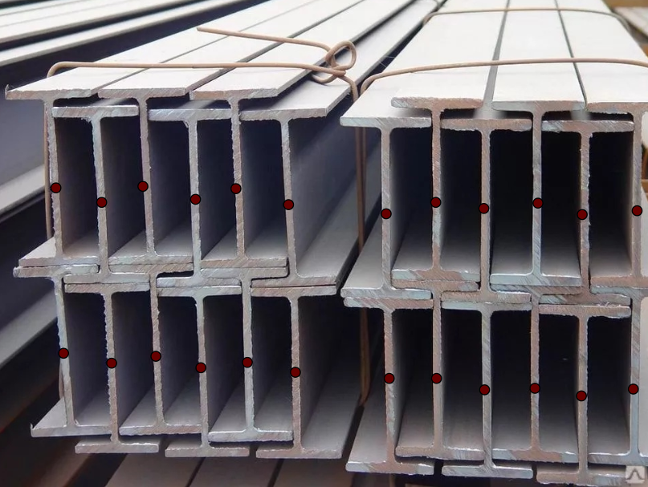
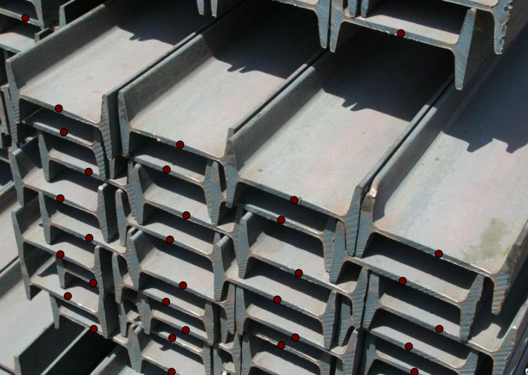
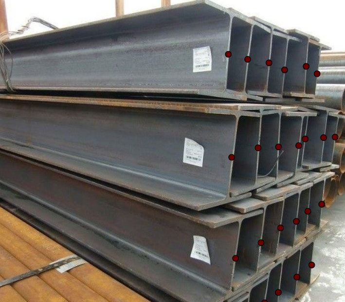
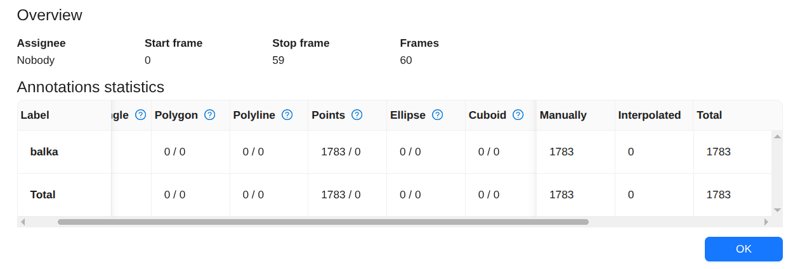
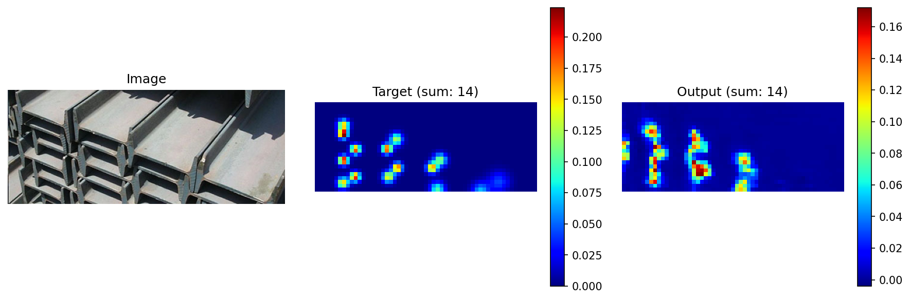
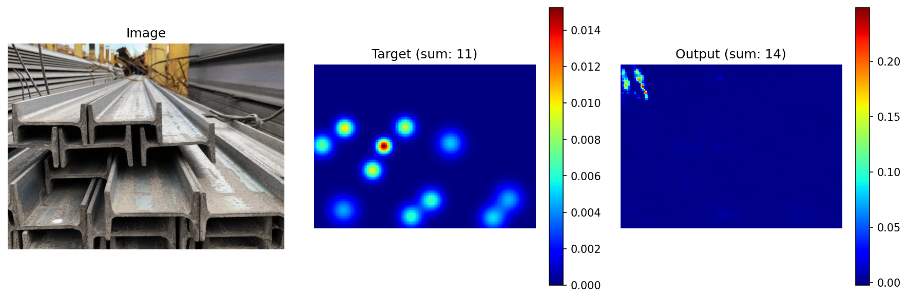
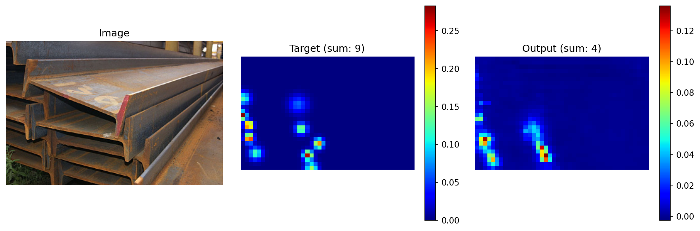
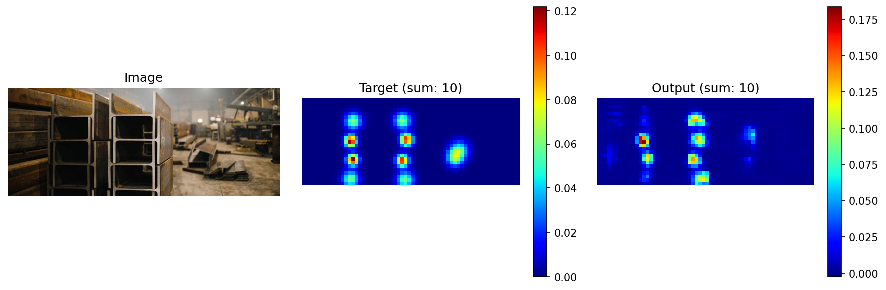
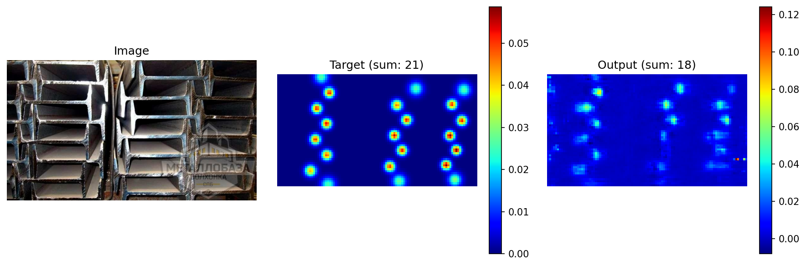
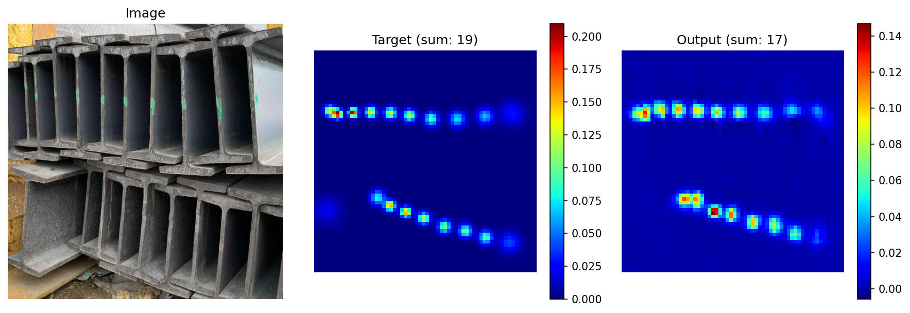

# CSRNet для подсчёта объектов

## Обзор

Этот проект реализует подсчёт объектов с использованием CSRNet, глубокой нейронной сети, предназначенной для оценки карт плотности и подсчёта объектов. Подход использует точечные аннотации в центрах объектов вместо ограничивающих прямоугольников или масок, что особенно полезно, когда объекты значительно перекрываются.

## Постановка задачи

В определённых задачах компьютерного зрения цель состоит в том, чтобы подсчитать количество объектов на изображении, где форма не является критичной. Традиционные методы аннотирования с использованием ограничивающих прямоугольников или сегментационных масок становятся избыточными в таких случаях. Аннотирование ограничивающими прямоугольниками может быть даже нежелательным, когда объекты сильно перекрываются, что затрудняет для сети их различение.

Для таких сценариев точечная разметка в центрах объектов или в ключевых точках обеспечивает более эффективное решение. Такой подход был применен для подсчёта количества балок на строительных фотографиях.

## Датасет
(Архив с разметкой: [ds.zip](ds.zip))

Был собран датасет из 60 изображений и размечен центральными точками боковоых граней балок:

  
  
  

Результатом стал небольшой датасет с точечными аннотациями:

  

### Разделение данных
- Обучающая выборка: 53 изображения
- Тестовая выборка: 6 изображений

## Модель

Использовалась архитектура CSRNet, которая предсказывает карты плотности вероятности объектов. CSRNet объединяет сверточные слои с расширением и фронтенд на основе VGG для получения высокоразрешающих карт плотности.

## Результаты

Модель показала многообещающие результаты на тестовой выборке с метрикой MAE (средняя абсолютная ошибка), измеряющей разницу между предсказанными и фактическими значениями количества объектов:

  
  
  

  
  
  

Несмотря на обучение всего на ~50 изображениях, модель демонстрирует точные возможности подсчёта объектов. На нескольких тестовых изображениях предсказанное количество балок очень близко к размеченному. Точность должна улучшиться при увеличении размера датасета.

## Метрики

- **Метрика**: MAE (средняя абсолютная ошибка) для предсказания количества объектов
- **Обучение**: Выполнялось на 53 изображениях
- **Тестирование**: Оценивалось на 6 изображениях

## Ключевые преимущества

1. **Эффективная разметка**: Точечные аннотации быстрее и проще, чем ограничивающие прямоугольники
2. **Обработка перекрытий**: Лучшая производительность с перекрывающимися объектами по сравнению с методами на основе прямоугольников
3. **Масштабируемость**: Точность улучшается с увеличением датасета
4. **Надежность**: Эффективна даже с ограниченными обучающими данными

## Перспективы развития

- Расширить датасет большим количеством разнообразных изображений
- Настроить гиперпараметры для лучшей производительности
- Исследовать перенос обучения из аналогичных доменов